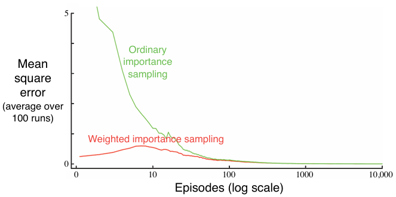

Blackjack MDP Simulation
This project simulates the classic casino card game Blackjack using Monte Carlo methods for reinforcement learning.
The game is modeled as an episodic finite Markov Decision Process (MDP) and follows a simplified version of standard Blackjack rules.

Objective
To implement and evaluate Blackjack strategies using Monte Carlo Exploring Starts (MC ES).

To demonstrate how Monte Carlo methods can discover the optimal policy for decision-making in uncertain environments.

To extend the project with off-policy evaluation techniques using importance sampling.

Game Rules
Each player competes independently against the dealer.

Both the dealer and the player start with 2 cards.

Face cards (J, Q, K) are worth 10. Aces can count as either 1 or 11.

Natural Blackjack: 21 from the first two cards (Ace + 10).

Player wins unless the dealer also has a natural, resulting in a draw.

Player Actions:

Hit (take another card)

Stick (stop taking cards)

If the player's sum exceeds 21 (bust), they lose immediately.

Dealer hits until reaching a sum of 17 or more, then sticks.

The winner is the one closest to 21 without busting.

Rewards

Outcome	Reward
Win	+1
Draw	0
Loss	-1
No intermediate rewards during the game.

No discounting applied (γ = 1).

📋 MDP Modeling
States are defined by:

Player’s current sum (12–21)

Dealer’s showing card (Ace–10)

Usable ace (True/False)

Total states: 200

Actions:

Hit

Stick

📈 Visualizations and Results
1. Initial Policy Value Function (Figure 5.1)
Visualizing the value function under the initial, random policy before learning:

  

2. Optimal Policy via Monte Carlo Exploring Starts (Figure 5.2)
After training with MC ES, the learned optimal policy is visualized:

  

3. Off-Policy Evaluation with Importance Sampling (Figure 5.3)
An additional extension was made to implement off-policy evaluation using importance sampling methods.
Here, the goal is to estimate the value of a single blackjack state using episodes generated from a different behavior policy.

Two methods were compared:

Ordinary Importance Sampling

Weighted Importance Sampling

  

Key Observations:
Both methods eventually converge to zero mean squared error (MSE).

Weighted Importance Sampling significantly reduces variance and achieves lower error faster, especially in early episodes.

This behavior is consistent with theoretical expectations and practical use cases.

📚 References
Sutton, R. S., & Barto, A. G. (2018). Reinforcement Learning: An Introduction (2nd Edition), Chapter 5.

Summary
✅ Implemented Blackjack as an episodic MDP.
✅ Trained optimal policies using Monte Carlo Exploring Starts (MC ES).
✅ Extended the project with off-policy evaluation using weighted importance sampling for robust value estimation.