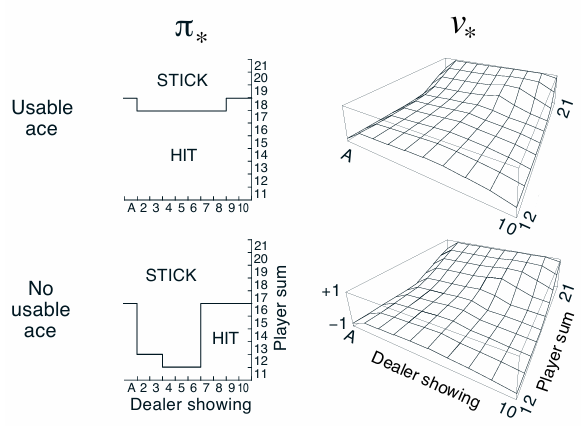

# 🃏 Blackjack MDP Simulation

This project simulates the classic casino card game **Blackjack** using **Monte Carlo methods** for reinforcement learning. The game is modeled as an episodic finite **Markov Decision Process (MDP)** and follows a simplified version of standard Blackjack rules.

---

## 🎯 Objective

To implement and evaluate Blackjack strategies using **Monte Carlo Exploring Starts (MC ES)** and demonstrate how Monte Carlo methods can find the **optimal policy** for decision-making in uncertain environments.

---

##  Game Rules

- Each player competes independently against the dealer.
- Both the dealer and the player start with 2 cards.
- Face cards (J, Q, K) are worth 10. Aces can count as either 1 or 11.
- **Natural**: 21 from the first 2 cards (Ace + 10).
  - Player wins unless dealer also has a natural → then it's a draw.
- Player can:
  - **Hit** (take more cards),
  - **Stick** (stop).
- Busting (sum > 21) results in a loss.
- Dealer hits until the sum is **17 or more**, then sticks.
- Closest to 21 wins.

### Rewards:

- `+1`: Win  
- `0`: Draw  
- `-1`: Loss  
- Intermediate rewards = 0  
- No discounting (γ = 1)

---

## MDP Modeling

**States** are defined by:
- Player's current sum (12–21)
- Dealer’s showing card (Ace–10)
- Usable ace (True/False)

**Total states**: 200

**Actions**:
- `Hit`: Take another card
- `Stick`: Stop and let the dealer play

---
### Visualizations:

- **Figure 5.1**: Value function under initial policy
- **Figure 5.2**: Optimal policy learned via MC ES

📚 References
Sutton, R. S., & Barto, A. G. (2018). Reinforcement Learning: An Introduction (2nd Edition), Chapter 5.

