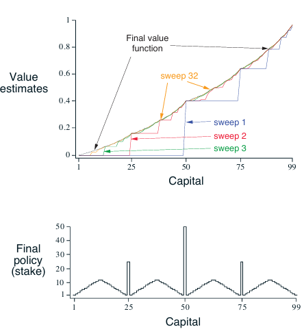

#  Gambler's Problem — Value Iteration in Reinforcement Learning

This project implements the **Gambler's Problem** using **Value Iteration**, based on the example from *Sutton and Barto's "Reinforcement Learning: An Introduction"*.

---

## Overview

A gambler aims to reach a goal of `$100` by betting on the outcome of a biased coin (with probability `p_h = 0.4` of heads).  
At each state (capital), the gambler can choose a stake and transitions to a new state depending on the result of the coin toss.

**Goal:** Maximize the probability of reaching the goal (capital = 100).

---
## Features
- Biased Coin Toss:
  - Probability of heads (p_h) = 0.4.
  - Reward only upon reaching the goal.
- States: Capital values from 0 to 100.
- Terminal States: 0 (loss) and 100 (goal) — both are absorbing.
- Value Iteration Algorithm:
  - Iteratively updates the value function V(s) for all states.
  - Computes optimal policy π*(s) that maximizes expected return.
  - Stops when the maximum change in value is less than a small threshold (ε = 1e-9).

## Expected Outputs
- Value Estimates per Sweep:
  - Shows how V(s) evolves over iterations.
- Final Policy:
  - Indicates the optimal stake to bet at each capital level.
- High-Resolution Plot:
  - Value estimates and final policy are saved as a .png image:
    - 
---

## Output

- **Value Estimates per Sweep**: How the value function evolves with each iteration.
- **Final Policy**: Optimal stake to bet at each capital level.

The output is saved as a high-resolution image:

