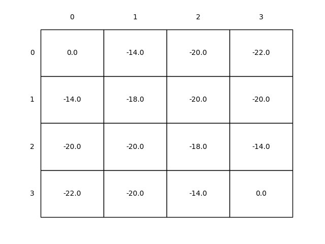

# Gridworld via Dynamic Programming

This project implements **policy evaluation**, **policy improvement**, and **policy iteration** for a simple 4×4 gridworld environment, based on **Example 4.1** from *"Reinforcement Learning: An Introduction"* (Sutton & Barto, 2nd Edition).

## Policy Evaluation (Prediction)

Consider the 4x4 gridworld shown below:

---

The non-terminal states are \( S = \{1,2,\ldots,14\} \).  
There are 4 possible actions in each state: **up**, **down**, **left**, **right**, which deterministically cause the corresponding state transitions, except that actions that would take the agent off the grid actually leave the state unchanged.

For example:
- \( p(6,1|5,\text{right}) = 1 \)
- \( p(7,1|7,\text{right}) = 1 \)

This is an **undiscounted, episodic task**.  
The reward is \(-1\) on all transitions until the terminal state is reached.

The terminal state is shaded in the figure (although it is shown in two places, it is formally one state).  
The expected reward function is:  
\[
r(s,a,s') = -1 \quad \text{for all } s, a, s'
\]

Suppose the agent follows the **equiprobable random policy** (all actions equally likely).

The left side of Figure 4.1 shows the sequence of value functions \(\{v_k\}\) computed by **iterative policy evaluation**.  
The final estimate is in fact \(v_\pi\), which gives for each state the negation of the expected number of steps from that state until termination.

---

## Results

The left column shows the sequence of approximations of the state-value function for the random policy.  
The final value function converges after:
- **In-place update**: 113 iterations
- **Out-of-place update**: 172 iterations

Both methods arrive at the same final value function but with different iteration counts.

---

## Policy Improvement

The greedy policies corresponding to the value function estimates are shown below:

The arrows in the diagram show the optimal actions at each state.

- The last policy is guaranteed to be **an improvement** over the random policy.
- In this case, it actually becomes **optimal**, achieving the minimum expected number of steps to reach the terminal state.
- In general, policy improvement guarantees improvement but not necessarily optimality after one iteration.

---

## Overwiew

We consider a 4×4 Gridworld with 14 non-terminal states and 1 terminal state.  
The agent can choose from **four actions** at each state: **up**, **down**, **left**, **right**.  
Actions deterministically cause state transitions unless they would take the agent off the grid, in which case the state remains unchanged.

- **Reward**:  
  - \(-1\) on all transitions until reaching the terminal state.
- **Terminal State**:  
  - Shaded in the figure (formally one state, shown twice for convenience).
- **Policy**:  
  - **Equiprobable random policy** — all actions are equally likely.

The task is **episodic** and **undiscounted**.
---
## 📈 Results
Policy iteration converged extremely quickly, discovering the optimal policy after just 1 iteration in this simple example.

The optimal policy proceeds to the terminal state in the minimum number of steps.
---
## 📚 References
Sutton, R. S., & Barto, A. G. (2018). Reinforcement Learning: An Introduction (2nd Edition), Example 4.1.

