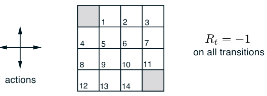

# Gridworld via Dynamic Programming

## Overwiew

We consider a 4×4 Gridworld with 14 non-terminal states and 1 terminal state.  
The agent can choose from **four actions** at each state: **up**, **down**, **left**, **right**.  
Actions deterministically cause state transitions unless they would take the agent off the grid, in which case the state remains unchanged.

- **Reward**:  
  - -1 on all transitions until reaching the terminal state.
- **Terminal State**:  
  - Shaded in the figure (formally one state, shown twice for convenience).
- **Policy**:  
  - **Equiprobable random policy** — all actions are equally likely.

---

## Features
- Gridworld Environment:
  - 4x4 grid with 16 states.
  - Terminal states at (0, 0) and (3, 3).
- Uniform Random Policy:
  - Agent takes one of four actions (left, up, right, down) with equal probability (1/4).
- Reward Function:
  - -1 for each step until a terminal state is reached.
  - 0 reward at terminal states.
- Dynamic Programming Methods:
  - In-place evaluation: Update the state-value function directly in the same array.
  - Out-of-place evaluation: Use a temporary copy to compute updates.
- Bellman Expectation Equation:
  - Iterative updates based on expected returns from each possible next state.

## Results

The left column shows the sequence of approximations of the state-value function for the random policy.  
The final value function converges after:
- **In-place update**: 113 iterations
- **Out-of-place update**: 172 iterations

Both methods arrive at the same final value function but with different iteration counts.

---

## Policy Improvement

The greedy policies corresponding to the value function estimates are shown below:

#### The arrows in the diagram show the optimal actions at each state.

- The last policy is guaranteed to be **an improvement** over the random policy.
- In this case, it actually becomes **optimal**, achieving the minimum expected number of steps to reach the terminal state.
- In general, policy improvement guarantees improvement but not necessarily optimality after one iteration.

---

> The task is **episodic** and **undiscounted**.
---

The optimal policy proceeds to the terminal state in the minimum number of steps.
---

## Files and Modules
* grid_world.py	- Core implementation.
* grid_world.ipynb - Jupyter notebook that generates plots.
* generated_images - Folder where are in_place and out_place figures
* README.md	- This documentation file.

