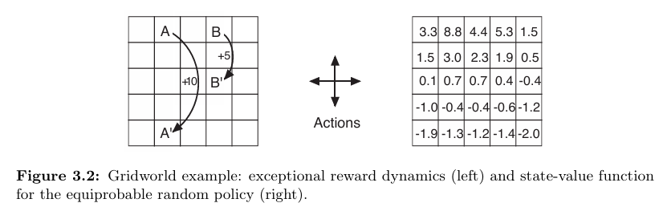

# Gridworld MDP

This project implements a **Gridworld Markov Decision Process (MDP)** where an agent navigates a 5x5 grid, receiving rewards based on its actions.  
Special states **A** and **B** provide additional rewards and transition the agent to **A'** and **B'**, respectively.

---

## Overview

The Gridworld MDP is a classic reinforcement learning environment that models an agent moving in a discrete grid.  
The agent can move in four directions: left, up, right, and down.  
Each move leads to a deterministic next state with an associated reward. Actions that would take the agent outside the grid leave it in the same place with a penalty.  
Two special states, **A** and **B**, provide higher rewards and teleport the agent to corresponding states **A'** and **B'**.  

This project demonstrates the computation of the optimal state-value function and the optimal policy using **value iteration** based on the Bellman optimality equation.  
Visualizations show the values and optimal actions for every state.

---

## Features

- Implementation of a 5x5 Gridworld environment with:
  - Deterministic state transitions
  - Rewards, including special handling for states **A** and **B**
- Computation of the optimal value function using value iteration
- Extraction of the optimal policy from the value function
- Visualization tools to display:
  - State-value function (with numerical values)
  - Optimal policy (with directional arrows)
- Modular and readable Python code with detailed docstrings
---

## Gridworld as Finite MDP

**Figure 3.2 (left)** shows a rectangular gridworld representation of a simple finite MDP.

- Each cell corresponds to a state of the environment.
- At each cell, four actions are possible: **north (up)**, **south (down)**, **east (right)**, and **west (left)**.
- Actions deterministically move the agent one cell in the respective direction.
- Actions that would take the agent off the grid leave the location unchanged but result in a reward of **-1**.
- Other actions result in a reward of **0**, except those from special states **A** and **B**:
  - From **state A**, all actions yield a reward of **+10** and move the agent to **A'**.
  - From **state B**, all actions yield a reward of **+5** and move the agent to **B'**.

---
## Dependencies

- Python 3.x
- `numpy` — numerical operations and array handling
- `matplotlib` — visualization and plotting

---

## Visualization

**Environment layout (Figure 3.2):**

---

## Files and Modules
> grid_world.py
  * Defines the Gridworld environment, including:

    * Grid size and coordinates of special states

    * Actions and their vector representations

    * The step(state, action) function which returns the next state and reward according to the environment dynamics

    * The draw(grid, is_policy=False) function which visualizes the grid either as a value function or as a policy with arrows

> grid_world.ipynb
  * Jupyter notebook that:

     * Sets up hyperparameters: uniform random policy action probabilities and discount factor 𝛾 = 0.9

     * Performs value iteration to compute the optimal state-value function using the Bellman optimality equation: 
                                     𝑉(𝑠)← max 𝑎 ∑ 𝑠′𝑃(𝑠′∣𝑠, 𝑎)[𝑅(𝑠, 𝑎, 𝑠′) + 𝛾𝑉(𝑠′)]

     * Checks for convergence and stops when changes are below a small threshold

     * Uses the draw() function to save visualizations of the optimal value function and optimal policy

     * Saves generated images as:

         * figure_3_5.png — state-value function grid (rounded values)

         * figure_3_5_policy.png — optimal policy grid with arrows

---

## Expected Outputs
* Visualizations of the Gridworld environment after running value iteration:
  
  ### Optimal State-Value Function (Figure 3.5): 

          * Numerical values indicating the expected return from each state under the optimal policy

          * Higher values in special states (A and B) reflecting their reward structure
     
          * Negative values near the grid edges due to penalty for attempting to move off-grid

 ### Optimal Policy (Figure 3.5 Policy):

          * Arrows in each cell indicating the best action(s) from that state

          * Multiple arrows possible if multiple actions tie for max value

* These images are saved in the generated_images directory.

