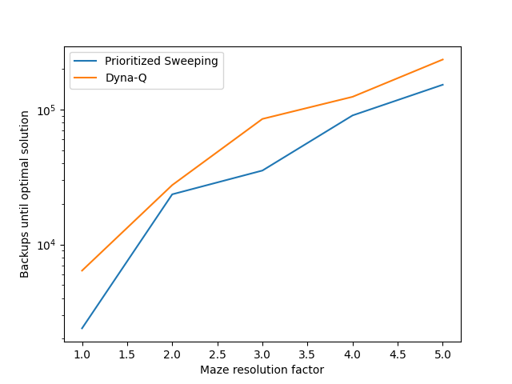

#  Dyna-Q and Prioritized Sweeping Algorithms

This project simulates and compares key **reinforcement learning** algorithms — **Dyna-Q**, **Dyna-Q+**, and **Prioritized Sweeping** — in a **maze environment**.  
It focuses on their performance in **non-stationary** and **increasingly complex** environments, showing how different planning strategies affect learning speed and adaptability.

---

##  Objective

To explore how reinforcement learning agents with **planning mechanisms** adapt to **changing or scaled environments**.  
The project compares the performance of:

-  **Dyna-Q agent** — Combines direct experience with simulated planning  
-  **Dyna-Q+ agent** — Adds exploration bonuses to adapt to change  
-  **Prioritized Sweeping agent** — Focuses updates where they matter most

---

##  Algorithms & Concepts

### 🔹 Dyna-Q
Combines **model-free** and **model-based** learning:  
agents learn from both real experience and simulated experiences generated by a learned model.

### 🔹 Dyna-Q+
Extends Dyna-Q for **non-stationary environments** by adding a **bonus reward** for unvisited state-action pairs,  
encouraging exploration and enabling the discovery of environmental changes.

### 🔹 Prioritized Sweeping
An advanced **planning algorithm** that prioritizes updates based on the **magnitude of state value changes**.  
It focuses computation on impactful transitions, leading to **5–10× faster convergence** in maze-solving tasks.

---

##  Usage

###  `dyna_maze.ipynb`
Demonstrates **Dyna-Q** on a simple static maze.  
Agents with higher planning steps (`n=50`) learn optimal paths significantly faster than agents with no planning (`n=0`).

###  `changing_maze.ipynb`
Explores how **Dyna-Q** and **Dyna-Q+** perform when the environment changes.

**Scenarios:**
- **Blocking Maze:** The optimal path becomes blocked → the agents must adapt.  
- **Shortcut Maze:** A new shorter path appears → **only Dyna-Q+** quickly adapts due to exploration bonuses.

###  `prioritized_sweeping.ipynb`
Implements and tests the **Prioritized Sweeping** algorithm on mazes of increasing resolution.  
The experiment replicates *Example 8.4* from Sutton & Barto.

**Findings:**
- Prioritized Sweeping dramatically reduces the number of backups (by 5–10×).  
- It maintains a **decisive advantage** over unprioritized Dyna-Q as maze complexity increases.  
- The log-scaled plot shows how efficient prioritization accelerates convergence.

---

##  Results

| Environment | Algorithm | Observation |
|--------------|------------|--------------|
| Static Maze | Dyna-Q | Learns optimal path quickly through simulated planning |
| Changing Maze | Dyna-Q+ | Adapts faster to new/blocked routes due to exploration bonus |
| Scaled Mazes | Prioritized Sweeping | Achieves 5–10× fewer backups to reach optimal path |

The plot below (from `prioritized_sweeping.ipynb`) summarizes the performance:

