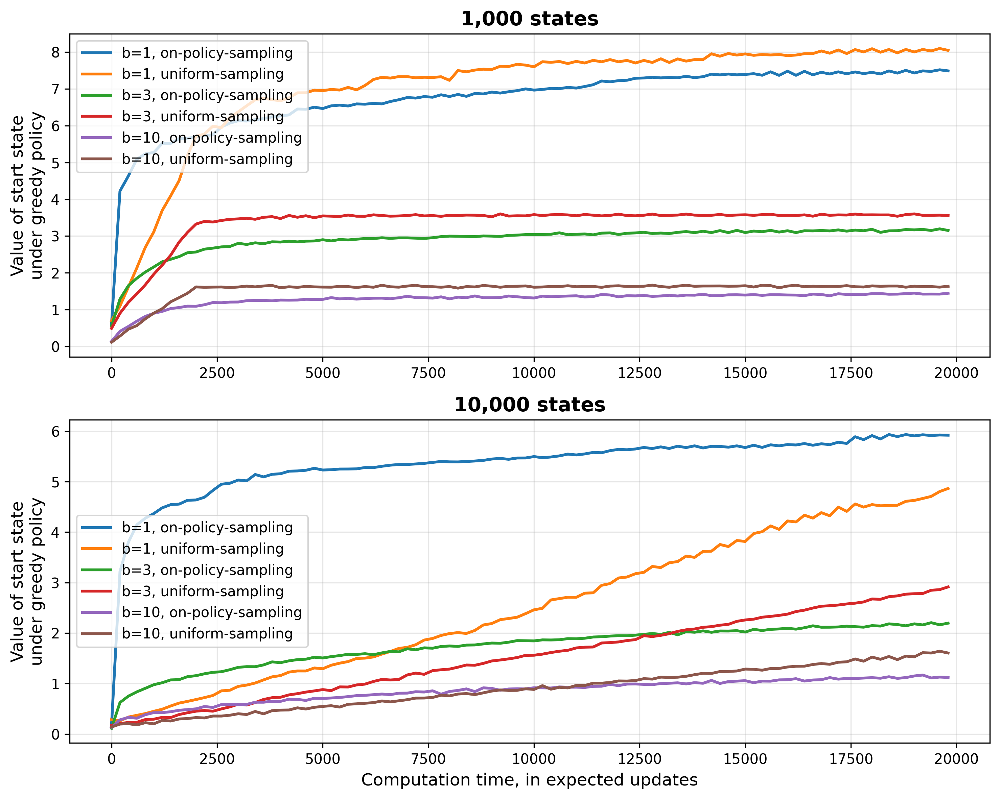

# Trajectory Sampling in Reinforcement Learning

This project reproduces **Figure 8.8** from *“Reinforcement Learning: An Introduction (2nd Edition)”* by Sutton & Barto. It compares the performance of **uniform** vs **on-policy trajectory sampling** in tabular one-step expected updates for randomly generated Markov Decision Processes (MDPs).

---

## Problem Description

- Simulate MDP tasks with:
  - `n_states` non-terminal states
  - 2 possible actions per state
  - `branching_factor` next states per state-action pair
  - Terminal transition probability = 0.1
  - Rewards drawn from a Gaussian distribution

- Evaluate **state-action value estimates** using two update distributions:
  1. **Uniform sampling:** cycle through all state-action pairs
  2. **On-policy sampling:** simulate episodes starting from the same state, updating states along the current ε-greedy policy

- Track the **value of the start state** under the greedy policy as an indicator of policy quality.

---

## Methods

- **Uniform Sampling:** Updates each state-action pair in a fixed sequence using expected updates.  
- **On-Policy Sampling:** Updates states according to their occurrence under the current ε-greedy policy. Initially leads to faster learning, especially with small branching factors, but may slow long-term convergence.

- **Evaluation:** Monte Carlo estimation of average returns from the start state over multiple runs.

---

## Experimental Setup

- **Runs:** 30 sample tasks per configuration  
- **States (`n_states`):** 1,000 and 10,000  
- **Branching factors (`b`):** 1, 3, 10  
- **Maximum expected updates:** 20,000  
- **Exploration probability (ε):** 0.1  
- **Metric:** Value of start state under greedy policy

---

## Results

- Plots are saved in `generated_images/figure_8_8.png`  
- **Observations:**
  - On-policy sampling achieves faster initial planning
  - Slower long-term convergence compared to uniform updates
  - Effect is stronger for smaller branching factors and larger state spaces

